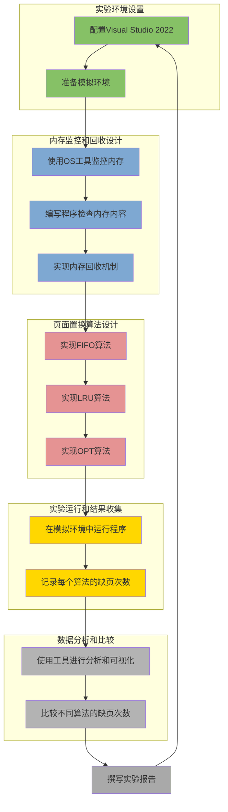
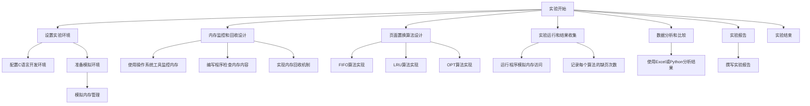

```mermaid
graph TB
    subgraph 实验环境设置
        A[配置Visual Studio 2022]
        B[准备模拟环境]
    end

    subgraph 内存监控和回收设计
        C[使用OS工具监控内存]
        D[编写程序检查内存内容]
        E[实现内存回收机制]
    end

    subgraph 页面置换算法设计
        F[实现FIFO算法]
        G[实现LRU算法]
        H[实现OPT算法]
    end

    subgraph 实验运行和结果收集
        I[在模拟环境中运行程序]
        J[记录每个算法的缺页次数]
    end

    subgraph 数据分析和比较
        K[使用工具进行分析和可视化]
        L[比较不同算法的缺页次数]
    end

    M[撰写实验报告]

    style A fill:#86C166
    style B fill:#86C166
    style C fill:#7EA8D2
    style D fill:#7EA8D2
    style E fill:#7EA8D2
    style F fill:#E59393
    style G fill:#E59393
    style H fill:#E59393
    style I fill:#FFD700
    style J fill:#FFD700
    style K fill:#B3B3B3
    style L fill:#B3B3B3
    style M fill:#A9A9A9

    A --> B
    B --> C
    C --> D
    D --> E
    E --> F
    F --> G
    G --> H
    H --> I
    I --> J
    J --> K
    K --> L
    L --> M
    M --> A
```
当然，我可以为您提供一个简洁的Markdown流程图，但在文字中使用Markdown并不支持图形、颜色等元素，因此我将为您提供一个流程图的文本描述，您可以使用专业的工具如Draw.io、Lucidchart等来创建漂亮的流程图。

```mermaid
graph TD
    A[实验开始] --> B[设置实验环境]
    B --> C[配置C语言开发环境]
    B --> D[准备模拟环境]
    D --> E[模拟内存管理]

    A --> F[内存监控和回收设计]
    F --> G[使用操作系统工具监控内存]
    F --> H[编写程序检查内存内容]
    F --> I[实现内存回收机制]

    A --> J[页面置换算法设计]
    J --> K[FIFO算法实现]
    J --> L[LRU算法实现]
    J --> M[OPT算法实现]

    A --> N[实验运行和结果收集]
    N --> O[运行程序模拟内存访问]
    N --> P[记录每个算法的缺页次数]

    A --> Q[数据分析和比较]
    Q --> R[使用Excel或Python分析结果]

    A --> S[实验报告]
    S --> T[撰写实验报告]

    A --> U[实验结束]
```
