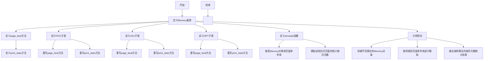

```mermaid
graph TD
  A[开始] --> B[定义Memory基类]
  B --> C[定义page_fault方法]
  C --> D[定义print_stats方法]
  B --> E[定义FIFO子类]
  E --> F[重写page_fault方法]
  E --> G[重写print_stats方法]
  B --> H[定义LRU子类]
  H --> I[重写page_fault方法]
  H --> J[重写print_stats方法]
  B --> K[定义OPT子类]
  K --> L[重写page_fault方法]
  K --> M[重写print_stats方法]
  B --> N[定义simulate函数]
  N --> O[接受Memory对象和页面参考串]
  N --> P[模拟进程访问页面并统计缺页次数]
  B --> Q[示例用法]
  Q --> R[创建不同算法的Memory对象]
  Q --> S[使用相同页面参考串进行模拟]
  Q --> T[输出每种算法的缺页次数统计结果]
  U[结束] --> V[.]

```