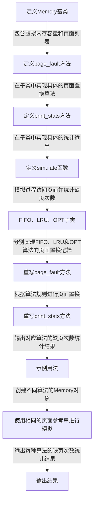

```mermaid
graph TD
  A[定义Memory基类] -->|包含虚拟内存容量和页面列表| B[定义page_fault方法]
  B -->|在子类中实现具体的页面置换算法| C[定义print_stats方法]
  C -->|在子类中实现具体的统计输出| D[定义simulate函数]
  D -->|模拟进程访问页面并统计缺页次数| E[FIFO、LRU、OPT子类]
  E -->|分别实现FIFO、LRU和OPT算法的页面置换逻辑| F[重写page_fault方法]
  F -->|根据算法规则进行页面置换| G[重写print_stats方法]
  G -->|输出对应算法的缺页次数统计结果| H[示例用法]
  H -->|创建不同算法的Memory对象| I[使用相同的页面参考串进行模拟]
  I -->|输出每种算法的缺页次数统计结果| J[输出结果]

```