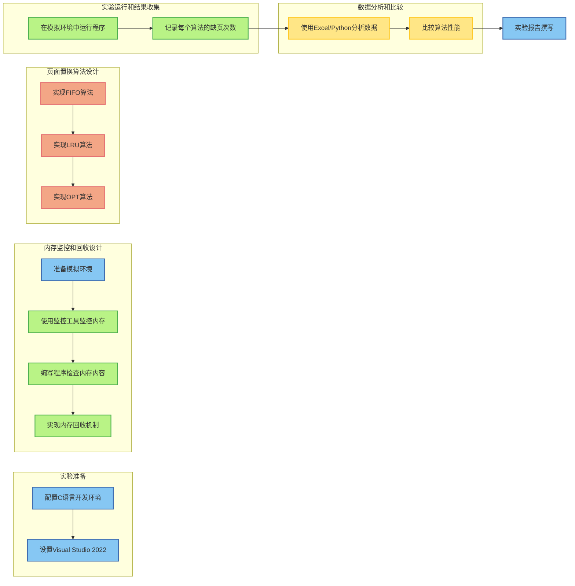

```mermaid
graph LR

style A fill:#86c7f3,stroke:#3f6db0,stroke-width:2px;
style B fill:#86c7f3,stroke:#3f6db0,stroke-width:2px;
style C fill:#86c7f3,stroke:#3f6db0,stroke-width:2px;
style D fill:#b9f386,stroke:#4caf50,stroke-width:2px;
style E fill:#b9f386,stroke:#4caf50,stroke-width:2px;
style F fill:#b9f386,stroke:#4caf50,stroke-width:2px;
style G fill:#f3a686,stroke:#e57373,stroke-width:2px;
style H fill:#f3a686,stroke:#e57373,stroke-width:2px;
style I fill:#f3a686,stroke:#e57373,stroke-width:2px;
style J fill:#b9f386,stroke:#4caf50,stroke-width:2px;
style K fill:#b9f386,stroke:#4caf50,stroke-width:2px;
style L fill:#ffe686,stroke:#ffca28,stroke-width:2px;
style M fill:#ffe686,stroke:#ffca28,stroke-width:2px;
style N fill:#86c7f3,stroke:#3f6db0,stroke-width:2px;

subgraph 实验准备
    A[配置C语言开发环境]
    B[设置Visual Studio 2022]
end

subgraph 内存监控和回收设计
    C[准备模拟环境]
    D[使用监控工具监控内存]
    E[编写程序检查内存内容]
    F[实现内存回收机制]
end

subgraph 页面置换算法设计
    G[实现FIFO算法]
    H[实现LRU算法]
    I[实现OPT算法]
end

subgraph 实验运行和结果收集
    J[在模拟环境中运行程序]
    K[记录每个算法的缺页次数]
end

subgraph 数据分析和比较
    L[使用Excel/Python分析数据]
    M[比较算法性能]
end

N[实验报告撰写]

A --> B
C --> D
D --> E
E --> F
G --> H
H --> I
J --> K
K --> L
L --> M
M --> N
```
```

