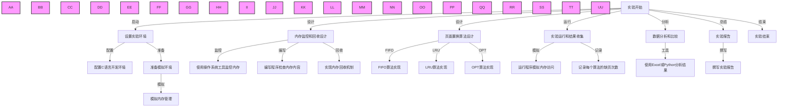

以下是一个垂直方向的流程图，同时我增加了一些颜色以提高可读性。

```mermaid
graph TD
    style AA fill:#f9f,stroke:#333,stroke-width:2px;
    style BB fill:#f9f,stroke:#333,stroke-width:2px;
    style CC fill:#f9f,stroke:#333,stroke-width:2px;
    style DD fill:#f9f,stroke:#333,stroke-width:2px;
    style EE fill:#f9f,stroke:#333,stroke-width:2px;
    style FF fill:#f9f,stroke:#333,stroke-width:2px;
    style GG fill:#f9f,stroke:#333,stroke-width:2px;
    style HH fill:#f9f,stroke:#333,stroke-width:2px;
    style II fill:#f9f,stroke:#333,stroke-width:2px;
    style JJ fill:#f9f,stroke:#333,stroke-width:2px;
    style KK fill:#f9f,stroke:#333,stroke-width:2px;
    style LL fill:#f9f,stroke:#333,stroke-width:2px;
    style MM fill:#f9f,stroke:#333,stroke-width:2px;
    style NN fill:#f9f,stroke:#333,stroke-width:2px;
    style OO fill:#f9f,stroke:#333,stroke-width:2px;
    style PP fill:#f9f,stroke:#333,stroke-width:2px;
    style QQ fill:#f9f,stroke:#333,stroke-width:2px;
    style RR fill:#f9f,stroke:#333,stroke-width:2px;
    style SS fill:#f9f,stroke:#333,stroke-width:2px;
    style TT fill:#f9f,stroke:#333,stroke-width:2px;
    style UU fill:#f9f,stroke:#333,stroke-width:2px;

    A[实验开始] -->|启动| B[设置实验环境]
    B -->|配置| C[配置C语言开发环境]
    B -->|准备| D[准备模拟环境]
    D -->|模拟| E[模拟内存管理]

    A -->|设计| F[内存监控和回收设计]
    F -->|监控| G[使用操作系统工具监控内存]
    F -->|编写| H[编写程序检查内存内容]
    F -->|回收| I[实现内存回收机制]

    A -->|设计| J[页面置换算法设计]
    J -->|FIFO| K[FIFO算法实现]
    J -->|LRU| L[LRU算法实现]
    J -->|OPT| M[OPT算法实现]

    A -->|运行| N[实验运行和结果收集]
    N -->|模拟| O[运行程序模拟内存访问]
    N -->|记录| P[记录每个算法的缺页次数]

    A -->|分析| Q[数据分析和比较]
    Q -->|工具| R[使用Excel或Python分析结果]

    A -->|总结| S[实验报告]
    S -->|撰写| T[撰写实验报告]

    A -->|结束| U[实验结束]
```

在这个流程图中，我使用了不同的填充颜色来表示不同的步骤，并在每个步骤下方标注了相应的操作或描述。您可以根据需要进行更多的定制和美化。