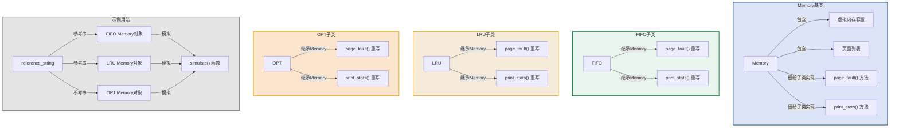

```mermaid
graph TD
    style Memory基类 fill:#DCE4F7,stroke:#1F4E79,stroke-width:2px
    style FIFO子类 fill:#E8F6ED,stroke:#00883E,stroke-width:2px
    style LRU子类 fill:#F5EBD8,stroke:#DAA520,stroke-width:2px
    style OPT子类 fill:#FCE5CD,stroke:#FFA500,stroke-width:2px
    style 示例用法 fill:#E5E5E5,stroke:#808080,stroke-width:2px

    subgraph Memory基类
        A[Memory]
        B[虚拟内存容量]
        C[页面列表]
        D["page_fault() 方法"]
        E["print_stats() 方法"]
    end

    subgraph FIFO子类
        F[FIFO]
        G["page_fault() 重写"]
        H["print_stats() 重写"]
    end

    subgraph LRU子类
        I[LRU]
        J["page_fault() 重写"]
        K["print_stats() 重写"]
    end

    subgraph OPT子类
        L[OPT]
        M["page_fault() 重写"]
        N["print_stats() 重写"]
    end

    subgraph 示例用法
        O["reference_string"]
        P["FIFO Memory对象"]
        Q["LRU Memory对象"]
        R["OPT Memory对象"]
        S["simulate() 函数"]
    end

    A -->|包含| B
    A -->|包含| C
    A -->|留给子类实现| D
    A -->|留给子类实现| E

    F -->|继承Memory| G
    F -->|继承Memory| H

    I -->|继承Memory| J
    I -->|继承Memory| K

    L -->|继承Memory| M
    L -->|继承Memory| N

    O -->|参考串| P
    O -->|参考串| Q
    O -->|参考串| R

    P -->|模拟| S
    Q -->|模拟| S
    R -->|模拟| S


```